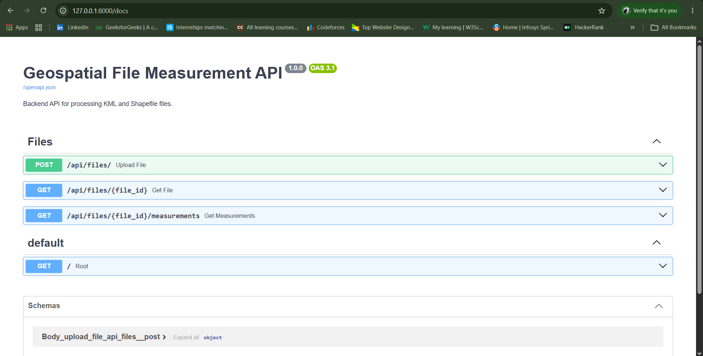
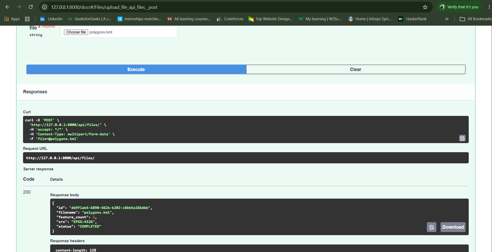
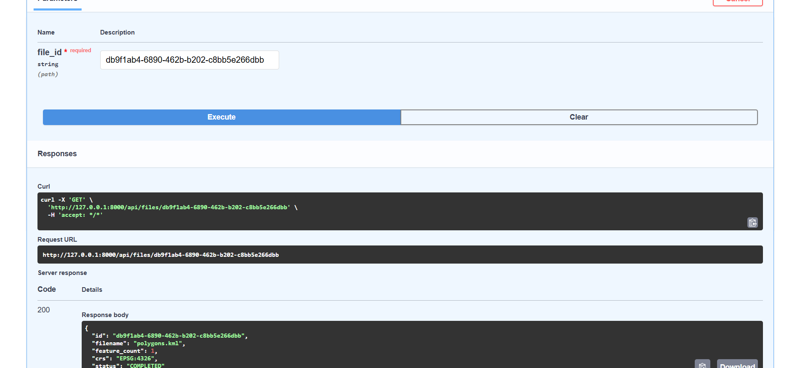
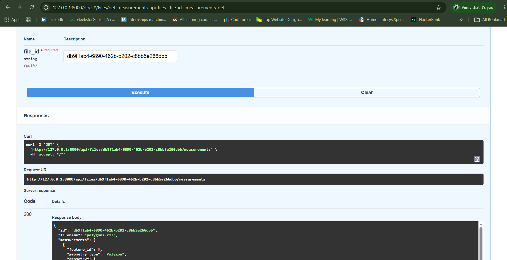

<h1 align="center">Geospatial File Measurement API</h1>

<p align="center">
  <a href="https://forthebadge.com">
    
  </a>
</p>

<p align="center">
   
   
</p>


A FastAPI backend service for uploading and processing **KML files** and **Shapefile ZIP files**, extracting geospatial features, and calculating measurements such as **polygon area and line length**.

## Features

- Upload entire KML files or Shapefile ZIP files.
- Validate uploaded file formats and Shapefile ZIP structure.
- Process geospatial features using GeoPandas and Shapely.
- Extract geometry type, geometry, CRS, and properties.
- Calculate:
  - Polygon / MultiPolygon → area in square meters
  - LineString / MultiLineString → length in meters
  - Point / MultiPoint → no measurement
- Handle unsupported geometry types gracefully.
- Transform geographic CRS to a suitable projected CRS before measurement.
- Preserve the original geometry and CRS in the API response.

---

## Available API Endpoints

| Method | Endpoint | Description |
|---|---|---|
| `POST` | `/api/files/` | Upload and process a KML or Shapefile ZIP |
| `GET` | `/api/files/{id}` | Retrieve information about a processed file |
| `GET` | `/api/files/{id}/measurements` | Retrieve measurements for all processed features |

---

### 1. Upload File

Uploads and processes a KML file or a Shapefile ZIP file.

**Endpoint:**

```http
POST /api/files/
```

**Request:**

```bash
curl -X POST "http://127.0.0.1:8000/api/files/" \
  -F "file=@polygons.kml"
```

**Response:**

```bash
{
  "id": "57a15674-b98b-4922-82fe-383d84735b33",
  "filename": "polygons.kml",
  "feature_count": 1,
  "crs": "EPSG:4326",
  "status": "COMPLETED"
}
```

### 2. Get File Information

Retrieves information about a previously processed file.

**Endpoint:**

```http
GET /api/files/{id}
```

**Request:**

```bash
curl "http://127.0.0.1:8000/api/files/57a15674-b98b-4922-82fe-383d84735b33"
```

**Response:**

```bash
{
  "id": "57a15674-b98b-4922-82fe-383d84735b33",
  "filename": "polygons.kml",
  "feature_count": 1,
  "crs": "EPSG:4326",
  "status": "COMPLETED"
}
```

### 3. Get Measurements

Retrieves the calculated measurements for all features in a processed file.

**Endpoint:**

```http
GET /api/files/{id}/measurements
```

**Request:**

```bash
curl "http://127.0.0.1:8000/api/files/57a15674-b98b-4922-82fe-383d84735b33/measurements"
```

**Response:**

```text
{
  "id": "57a15674-b98b-4922-82fe-383d84735b33",
  "filename": "polygons.kml",
  "measurements": [
    {
      "feature_id": 0,
      "geometry_type": "Polygon",
      "geometry": {
        "type": "Polygon",
        "coordinates": [
          [
            [80.0, 13.0],
            [80.01, 13.0],
            [80.01, 13.01],
            [80.0, 13.01],
            [80.0, 13.0]
          ]
        ]
      },
      "crs": "EPSG:4326",
      "properties": {},
      "measurement": 144511.23,
      "unit": "square_meters",
      "status": "SUCCESS"
    }
  ]
}
```
---

## Architecture

### 1. File-Processing Flow

```text
Upload File
     │
     ▼
Validate File Type
     │
     ├── KML ──► Validate XML
     │
     └── ZIP ──► Check Size
                  │
                  ▼
             Validate Shapefile
             (.shp, .shx, .dbf)
     │
     ▼
Temporary File Storage
     │
     ▼
Read with GeoPandas
     │
     ▼
Extract Features
     │
     ▼
Calculate Measurements
     │
     ▼
Store File Record
     │
     ▼
Return API Response
```

### 2. Measurement Calculation Flow
Measurements are calculated using projected geometries rather than geographic coordinates
```text
Feature
   │
   ▼
Geometry Type
   │
   ├── Polygon / MultiPolygon
   │       └── Calculate Area → square_meters
   │
   ├── LineString / MultiLineString
   │       └── Calculate Length → meters
   │
   ├── Point / MultiPoint
   │       └── No Measurement
   │
   └── Unsupported Geometry
           └── UNSUPPORTED
```

### 3. CRS Handling
The application preserves the original geometry and CRS in the API response.
For measurement calculations, geographic data such as EPSG:4326 is transformed into a suitable projected CRS.

```text
Original CRS
    │
    ▼
Estimate suitable projected CRS
    │
    ▼
Transform geometry
    │
    ▼
Calculate measurement
    │
    ├── Area → square meters
    └── Length → meters
```

### 4. Application Structure

```text
├── api/
│   └── files.py              # API endpoints
├── models/
│   ├── file_record.py        # File record model
│   └── store.py              # In-memory storage
├── services/
│   ├── file_validator.py     # File validation
│   ├── file_storage.py       # Temporary file storage
│   └── geospatial.py         # Geospatial processing
└── main.py                   # FastAPI application
```

---

## Design Decisions

### FastAPI

FastAPI was selected because the assignment requires a REST-based backend service. It provides automatic API documentation, request validation, and simple file-upload handling.

### GeoPandas

GeoPandas is used to read and process KML and Shapefile data. It also works with Shapely and PyProj for geometry operations and CRS transformations.


### Shapefile Validation

A Shapefile consists of multiple related files. The application verifies that the uploaded ZIP contains the required:

- `.shp`
- `.shx`
- `.dbf`

files before processing.

### CRS Transformation

Measurements are not calculated directly from geographic coordinates such as `EPSG:4326`. The application estimates a suitable projected CRS and transforms the geometry before calculating area or length.

### In-Memory Storage

For this assignment, processed file information is stored in memory. This keeps the implementation simple and avoids introducing a database that is not required for the core geospatial processing.

---

## Learning 

- Learned how Shapefiles are structured and processed as a collection of related files.
- Learned how latitude and longitude coordinates represent geographic locations.
- Learned why geographic coordinates such as `EPSG:4326` should not be directly used for area and distance calculations.
- Learned how CRS transformation to a suitable projected coordinate system enables measurements in meters.
- Learned how geospatial features such as points, lines, and polygons require different measurement approaches.
  
## Future Scope

- Additional geospatial file formats
- Interactive map visualization of uploaded features
- Persistent database storage
- Include the calculated measurement of each feature in the file information response.

---

## Setup

### Prerequisites

- Python 3.11 or later
- Git

### 1. Clone the Repository

```bash
git clone https://github.com/SubikshaMuralidass/geospatial-file-measurement-api.git
cd geospatial-file-measurement-api
```

### 2. Create a Virtual Environment

#### Windows

```bash
python -m venv .venv
.venv\Scripts\activate
```

#### Linux / macOS

```bash
python3 -m venv .venv
source .venv/bin/activate
```

### 3. Install Dependencies

```bash
pip install -r requirements.txt
```

### 4. Run the Application

```bash
uvicorn app.main:app --reload
```

### 5. Open API Documentation

```bash
http://127.0.0.1:8000/docs 
```

## Screenshots

### Endpoints



### File Upload



### Information 



### Measurement


